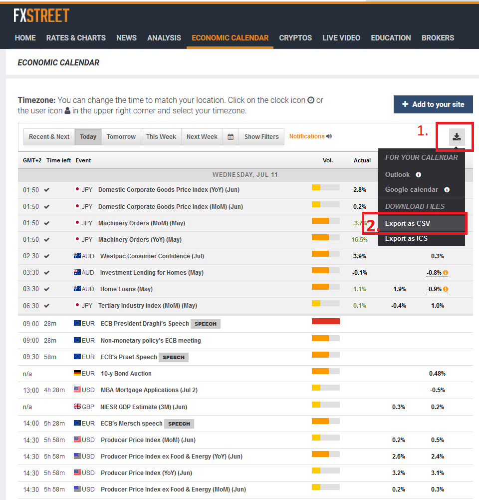
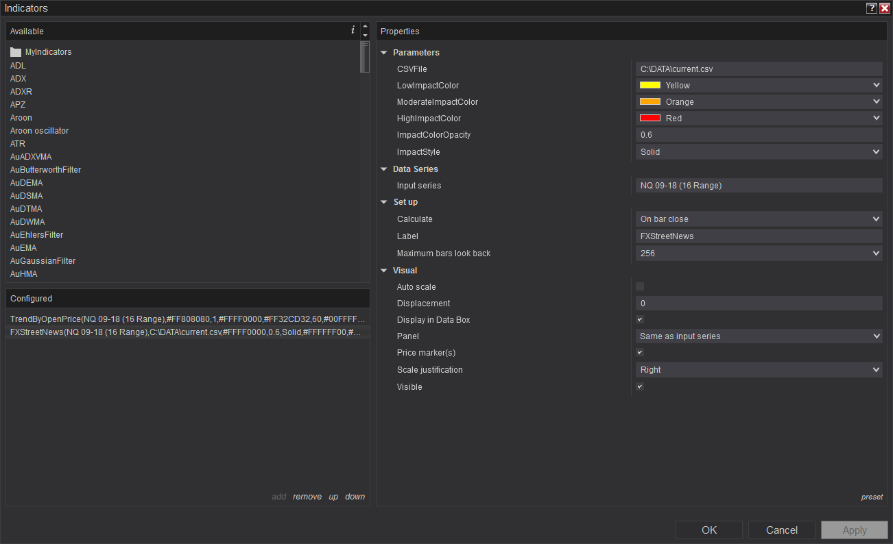
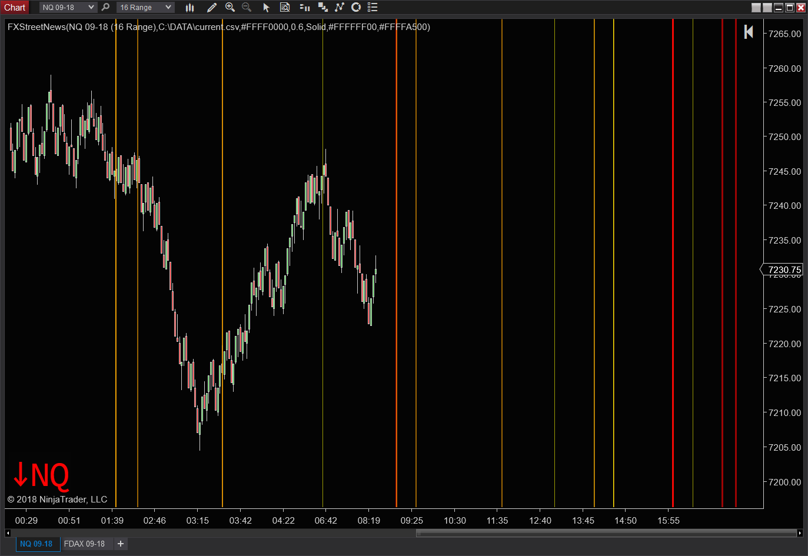
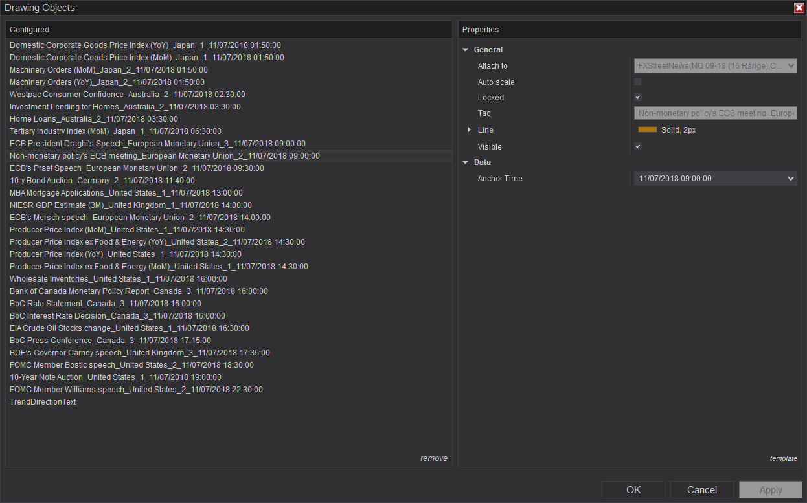

# FXStreetNews Ninjatrader 8 Indicator

## 1. About

**This indicator draws three different vertical lines when a news events occur, based on the impact of the event.**

* Compatible with NT8
* It uses FXStreet news CSV dump
* CSV file is processed in `(State == State.Configure)` section with `TextFieldParser` class. So the CSV file is read only once after the indicator initialization.  
  Reference DLL: `C:\Windows\Microsoft.NET\Framework\v4.0.30319\Microsoft.VisualBasic.dll`
* It should automatically adjust datetimes by converting between timezones:  
  `newsDate.Add(TimeZoneInfo.ConvertTimeFromUtc(DateTime.ParseExact(fields[0], "MM/dd/yyyy HH:mm:ss", CultureInfo.InvariantCulture), TimeZoneInfo.Local));`

|  Impact  | Line Color |
|:--------:|:----------:|
|   Low    |   Yellow   |
| Moderate |   Orange   |
|   High   |    Red     |

## 2. Installation

* Download `FXStreetNewsNT8.zip`
* Navigate to: `Tools -> Import -> NinjaScript Add-On...`
* Browse to `FXStreetNewsNT8.zip`, then import

## 3. Using FXStreetNews indicator
* Configure your filter on fxstreet. Select the news which you are interested in.  
  You can edit the CSV with MS Excel first (make sure the datetime format stays as it is: `MM/dd/yyyy HH:mm:ss`)
* Download FXStreet CSV data. Example path: `C:\DATA\current.csv`
* Open an instrument, like NQ
* Apply FXStreetNews indicator
* Set the path for the `CSVFile` parameter
* Enjoy

## 4. License: Mozilla Public License, version 2.0
https://www.mozilla.org/en-US/MPL/2.0/

## 5. Screenshots

  
  
  
  
